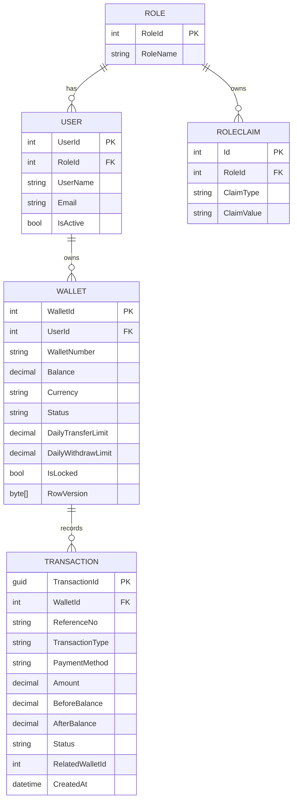

# Fintech Wallet API


A secure ASP.NET Core Web API backend that supports user registration, JWT/JWE authentication, digital wallet operations, administrative balance management, payment gateway integrations, and automated EC2 deployments.

---

## Table of Contents

- [Features](#features)
- [Tech Stack](#tech-stack)
- [Architecture](#architecture)
- [Core Wallet Engine](#core-wallet-engine)
- [GitHub Actions CI/CD](#github-actions-cicd)
- [Configuration](#configuration)
- [API Endpoints](#api-endpoints)
- [Authentication](#authentication)
- [Database](#database)

---

## Features

#### Authentication & Authorization

* User registration with automatic wallet creation
* Secure login with BCrypt password hashing
* JWT/JWE authentication with refresh tokens
* User and Admin role management
* Permission-based authorization

#### Wallet Operations

* Wallet-to-wallet transfer
* Withdraw
* Bank statement lookup
* Wallet detail lookup

#### Deposit Management

* Manual bank deposit approval
* Online payment gateway deposit initialization
* Online payment gateway webhook handling

#### Administration

* Wallet lock/unlock
* Balance adjustment
* Pending bank deposit approval

#### API & Infrastructure

* API versioning (`/api/v1/...`)
* Login rate limiting
* Swagger API documentation
* Global exception handling
* GitHub Actions build and deployment workflow


---

## Tech Stack

| Layer | Technology |
| --- | --- |
| Framework | ASP.NET Core 8 Web API |
| Language | C# |
| Database | SQL Server |
| ORM | Entity Framework Core 8, Database First |
| Architecture | Monolithic Layered (N-Tier) Architecture |
| Authentication | JWT Bearer with encrypted token support |
| Authorization | Roles and dynamic policies |
| Documentation |URL API Versioning & Swagger OpenAPI |
| Deployment | GitHub Actions, EC2, systemd, Nginx |

---

## Architecture

The application follows a monolithic layered architecture that separates API endpoints, business logic, data access, shared helpers, middleware, and database access.

### Project Structure

```text
fintech-wallet-api/
├── .github/
│   └── workflows/
│       ├── ci-cd.yml              # Main CI/CD pipeline
│       ├── reusable-build.yml     # Reusable deployment workflow
│       └── infra/
│           ├── production.service # Production systemd unit
│           ├── staging.service    # Staging systemd unit
│           └── walletapi.conf     # Nginx reverse proxy configuration
├── wallet.sln
├── README.md
└── wallet/                        # Main Web API Application
    ├── Controllers/               # API Routing Layer & Request Contracts
    ├── Middleware/                # Request Pipeline Hooks & Global Exception Handlers
    ├── Models/                    # Inbound Request/Outbound Response DTOs
    ├── Services/                  # Core Business Domain & External Gateways
    ├── DALs/                      # Repository Layer & Unit of Work 
    ├── Data/                      # Database-First DBContext & Persistent Entities
    ├── Constants/                 # Shared application constants
    ├── Exceptions/                # Custom application exceptions
    ├── Helpers/                   # Signature-Verification, Reference-Generation, Validation & Transaction-Runner Logic
    ├── Utils/                     # Unique Identifier Factory (Wallet & Reference Number Generation)
    ├── Properties/                # Visual Studio Launch Settings
    ├── Program.cs                 # Startup, middleware, API versioning, Swagger, and DI 
    ├── appsettings.json           # Default Settings
    ├── appsettings.Staging.json   # Staging Environment Overrides
    ├── appsettings.Production.json# Production Environment Overrides
    └── wallet.csproj              # Single Project Manifest File
```

### Request Flow

```text
Client
   │
   ▼
Controllers
   │
   ▼
Services
   │
   ▼
DALs
(Repositories / Unit of Work)
   │
   ▼
Entity Framework Core
   │
   ▼
SQL Server
```

### Architectural Characteristics

- Monolithic Layered (N-Tier) Design
- Repository & Unit of Work (DALs)
- Database-First Schema Management
- Global Exception Handling
- Role & Permission-Based Authorization
- Unique Identifier & Idempotency Key Generation
- Atomic Transaction Execution Management
- Optimistic Concurrency Control (RowVersion)
- Automated CI/CD with Nginx & Systemd Host Deployment

---

## Core Wallet Engine

The wallet engine is designed around transaction integrity, concurrency safety, and balance consistency.

### Deposit Workflow

```text
Deposit
├── Manual Bank Deposit
│   ├── Validate Wallet
│   ├── Generate Reference Number
│   ├── Create Pending Transaction
│   ├── Begin Transaction
│   ├── Save Pending Transaction
│   └── Commit Transaction
│
├── Manual Admin Verification/Approval
│   ├── Find Pending Bank Deposit Transaction
│   ├── Validate Wallet
│   ├── Validate Deposit Type And Payment Method
│   ├── Return Previous Result If Duplicate
│   ├── Credit Wallet Balance
│   ├── Update Audit Information
│   ├── Mark Transaction Success
│   └── Commit Transaction
│
└── Payment Gateway Deposit
    ├── Validate Wallet
    ├── Create Pending Transaction
    ├── Begin Transaction
    ├── Save Pending Transaction
    ├── Commit Transaction
    ├── Generate Payment URL
    ├── Customer Completes Payment
    ├── Gateway Notify
    │   ├── MD5 Digital Signature Integrity Verification
    │   ├── Validate Merchant Order ID
    │   ├── Find Transaction
    │   └── Return Frontend Success/Fail URL
    └── Gateway Callback
        ├── MD5 Digital Signature Integrity Verification
        ├── Validate Merchant Order ID
        ├── Find Pending Transaction
        ├── Validate Wallet
        ├── Credit Wallet Balance If Success
        ├── Mark Transaction Success Or Failed
        ├── Update Audit Information
        └── Commit Transaction

```

### Withdrawal Workflow

```text
Withdrawal
├── Validate Wallet
├── Check Existing Reference Number
│   └── Return Previous Result If Duplicate
├── Validate Withdrawal Amount
├── Check Available Balance
├── Check Daily Withdrawal Limit
│   └── Daily Total + Amount <= Limit
├── Begin Transaction 
├── Deduct Wallet Balance 
├── Save Transaction Record 
├── Update Audit Information
└── Commit Transaction

```

### Transfer Workflow

```text
Transfer
├── Validate Sender Wallet
├── Validate Receiver Wallet
├── Prevent Self Transfer
├── Validate Currency
├── Check Available Balance
├── Check Daily Transfer Limit
├── Check Existing Reference Number
│   └── Return Previous Result If Duplicate
├── Generate Transfer References
│   ├── TRF-123456-OUT
│   └── TRF-123456-IN
├── Begin Transaction
├── Sender Settlement
│   ├── Debit Sender Wallet
│   └── Create TransferOut Record
├── Receiver Settlement
│   ├── Credit Receiver Wallet
│   └── Create TransferIn Record
├── Update Audit Information
└── Commit Transaction

```

### Concurrency Control

```text
Concurrency Control (RowVersion)
├── Transaction A Reads Wallet (Version 10)
├── Transaction B Reads Wallet (Version 10)
├── Transaction A Updates Wallet
│   └── Version 10 → 11
├── Transaction A Commits
├── Transaction B Attempts Update
│   ├── Expected Version = 10
│   └── Actual Version = 11
└── Concurrency Exception Thrown
```


## GitHub Actions CI/CD

```text 
Push [develop] Branch  ──► Staging Automation Pipeline
Push [main] Branch     ──► Production Automation Pipeline
```

Deployment Steps


### Workflow Files

| File | Purpose |
| --- | --- |
| `.github/workflows/ci-cd.yml` | Base multi-branch route coordinator (main & develop) |
| `.github/workflows/reusable-build.yml` | Shared build, artifact management, deployment, and service polling script |
| `.github/workflows/infra/staging.service` | Staging `systemd` service file |
| `.github/workflows/infra/production.service` | Production `systemd` service file |
| `.github/workflows/infra/walletapi.conf` | Nginx reverse proxy config |

### Branch Flow

| Branch/Event | Environment | Port | Deploy Path |
| --- | --- | --- | --- |
| Push to `develop` | Staging | `5151` | `/var/www/walletapi-staging` |
| Push to `main` | Production | `5001` | `/var/www/walletapi` |


### Required GitHub Secrets

```text
EC2_HOST
EC2_USERNAME
EC2_SSH_KEY
DB_CONNECTION
JWT_KEY
JWT_ENCRYPTION_KEY
PAYMENT_SECRET_KEY
```

These secrets are written to the server environment file as:

```text
ConnectionStrings__Wallet
Jwt__Key
Jwt__EncryptionKey
PaymentGateway__SecretKey
```

---

## Configuration

Update `wallet/appsettings.json` for local development, or use environment variables for deployment.

```json
{
  "ConnectionStrings": {
    "Wallet": "Server=localhost;Database=WalletDb;Trusted_Connection=True;TrustServerCertificate=True"
  },
  "Jwt": {
    "Key": "base64-encoded-signing-key",
    "EncryptionKey": "base64-encoded-encryption-key",
    "Issuer": "MyWalletAPI",
    "Audience": "MyWalletClients"
  },
  "PaymentGateway": {
    "SecretKey": "your-payment-gateway-secret"
  },
  "Wallet": {
    "BusinessTimeZone": "Asia/Yangon"
  }
}
```

Important:

- `Jwt:Key` must be Base64 encoded.
- `Jwt:EncryptionKey` must be Base64 encoded.
- Do not commit real database strings, JWT secrets, or payment gateway secrets.
- Production secrets should be stored in GitHub Secrets, environment variables.

---

## API Endpoints

Base URL:

```text
/api/v1
```

### Auth

| Method | Endpoint | Description |
| --- | --- | --- |
| POST | `/api/v1/auth/register` | Register a user and create wallet |
| POST | `/api/v1/auth/login` | Login and receive token |
| POST | `/api/v1/auth/refresh-token` | Rotate access and refresh tokens |

### Wallet

Requires `User` role and Bearer token.

| Method | Endpoint | Description |
| --- | --- | --- |
| POST | `/api/v1/wallet/deposit/bank-transfer` | Create manual bank deposit request |
| POST | `/api/v1/wallet/deposit/gateway` | Initialize gateway deposit |
| POST | `/api/v1/wallet/withdraw` | Withdraw from wallet |
| POST | `/api/v1/wallet/transfer` | Transfer to another wallet |
| GET | `/api/v1/wallet/bank-statement` | Get transaction history |
| GET | `/api/v1/wallet/wallet` | Get wallet details |

### Admin

Requires `Admin` role and Bearer token.

| Method | Endpoint | Description |
| --- | --- | --- |
| POST | `/api/v1/admin/wallets/{id}/lock` | Lock or unlock wallet |
| POST | `/api/v1/admin/wallet/adjust-balance` | Credit or debit wallet balance |
| POST | `/api/v1/admin/deposit/approve` | Approve pending bank deposit |

### Payment Gateway

These endpoints allow anonymous access because they are intended for payment gateway callbacks. Signature verification is handled with `PaymentGateway:SecretKey`.

| Method | Endpoint | Description |
| --- | --- | --- |
| GET | `/api/v1/payment/payment-notify` | Handle gateway redirect/notify result |
| POST | `/api/v1/payment/payment-confirm` | Settle gateway transaction callback |

## Response Format

Success response:

```json
{
  "success": true,
  "message": "Login successful.",
  "data": {}
}

```
Failure response:

```json
{
  "success": false,
  "message": "Unauthorized access. Token is missing or invalid.",
  "data": null
}
```
---

## Authentication

Protected endpoints require this header:

```http
Authorization: Bearer <access-token>
```

The API validates:

- Token issuer
- Token audience
- Token lifetime
- Signing key
- Token decryption key
- User role
- Dynamic permission policy

---

## Database

The project uses Entity Framework Core Database-First approach with reverse engineering from an existing SQL Server database.

Entity Relationship Diagram (ERD):



```bash
dotnet ef dbcontext scaffold "<connection-string>" Microsoft.EntityFrameworkCore.SqlServer --context WalletdbContext --output-dir Data/Entities --context-dir Data --force
```

