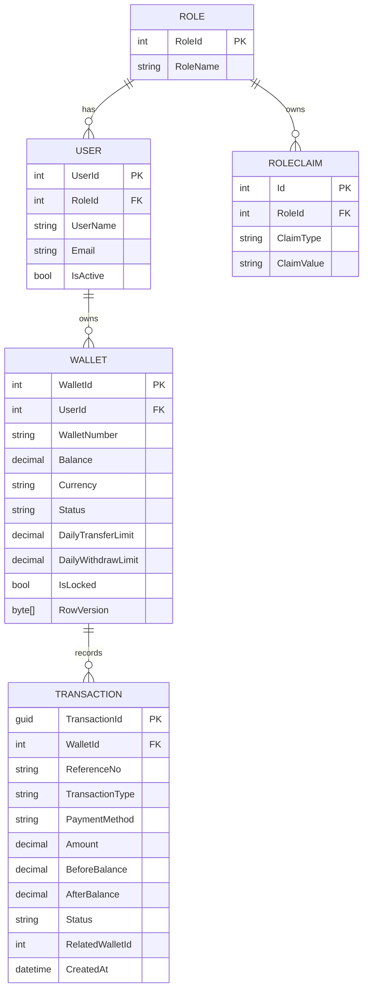

# Fintech Wallet API


A secure ASP.NET Core Web API backend that supports user registration, JWT/JWE authentication, digital wallet operations, administrative balance management, payment gateway integrations, and automated EC2 deployments.

---

## Table of Contents

- [Features](#features)
- [Tech Stack](#tech-stack)
- [Architecture](#architecture)
- [Project Structure](#project-structure)
- [Core Wallet Engine](#core-wallet-engine)
- [GitHub Actions CI/CD](#github-actions-cicd)
- [Getting Started](#getting-started)
- [Configuration](#configuration)
- [API Endpoints](#api-endpoints)
- [Authentication](#authentication)
- [Database](#database)
- [Useful Commands](#useful-commands)

---

## Features

- User registration with automatic wallet creation
- Secure login with BCrypt password hashing
- JWT Bearer authentication with token encryption support
- Refresh token rotation
- Role-based access control for `User` and `Admin`
- Dynamic permission policies such as `Deposit`, `Transfer`, `Statement`, and `CashOut_Withdraw`
- Manual bank-transfer deposit flow
- Online payment gateway deposit initialization
- Withdraw and wallet-to-wallet transfer
- Bank statement and wallet detail lookup
- Admin wallet lock/unlock
- Admin manual credit/debit adjustment
- Admin pending bank deposit approval
- Payment gateway notify and confirmation endpoints
- Global exception handling with consistent API responses
- Swagger/OpenAPI documentation
- Login rate limiting
- URL-based API versioning, for example `/api/v1/...`
- GitHub Actions build and deployment workflow

---

## Tech Stack

| Layer | Technology |
| --- | --- |
| Framework | ASP.NET Core 8 Web API |
| Language | C# |
| Database | SQL Server |
| ORM | Entity Framework Core 8, Database First |
| Architecture | Clean Architecture |
| Authentication | JWT Bearer with encrypted token support |
| Authorization | Roles and dynamic policies |
| Password Hashing | BCrypt.Net-Next |
| Documentation | Swagger / Swashbuckle |
| Deployment | GitHub Actions, EC2, systemd, Nginx |

---

## Architecture

The application follows a layered architecture that separates API endpoints, business logic, infrastructure, and data access.

### Project Structure

```text
fintech-wallet-api/
|
|-- .github/
|   `-- workflows/
|       |-- ci-cd.yml              # Main GitHub Actions pipeline
|       |-- reusable-build.yml     # Reusable build and deploy workflow
|       `-- infra/
|           |-- production.service # Production systemd service
|           |-- staging.service    # Staging systemd service
|           `-- walletapi.conf     # Nginx reverse proxy config
|
|-- wallet.sln
|-- README.md
|
`-- wallet/
    |-- Constants/                 # Shared application constants and configuration values
    |-- Controllers/               # API layer endpoints
    |-- DALs/                      # Data access repositories and Unit of Work
    |-- Data/                      # Database First DbContext and entities
    |-- Exceptions/                # Custom exceptions
    |-- Helpers/                   # Validation, hashing, transaction references, audit
    |-- Middleware/                # Global exception handling and request pipeline middleware
    |-- Models/                    # Request and response DTOs used by API contracts
    |-- Properties/                # Launch settings
    |-- Services/                  # Business logic for wallet transactions, payment gateway integration, token management, and authorization policies
    |-- Utils/                     # Utility classes
    |-- Program.cs                 # Startup and DI configuration
    |-- appsettings.json
    |-- appsettings.Staging.json
    |-- appsettings.Production.json
    `-- wallet.csproj
```

### Request Flow

```text
Client
   │
   ▼
Controllers
   │
   ▼
Services
   │
   ▼
DALs (Repositories / Unit of Work)
   │
   ▼
Entity Framework Core
   │
   ▼
SQL Server
```
### Architectural Characteristics

- Layered Architecture
- Repository & Unit of Work Pattern
- Database-First Entity Framework Core
- Dependency Injection
- Global Exception Handling
- Role & Permission-Based Authorization
- CI/CD with GitHub Actions
- Optimistic Concurrency Control (RowVersion)

---

## Core Wallet Engine

The wallet engine is designed around transaction integrity, concurrency safety, and balance consistency.

### Deposit Workflow

```text
Deposit
├── Manual Bank Deposit
│   ├── Generate Reference Number
│   ├── Create Pending Transaction
│   ├── Admin Approval
│   ├── Credit Wallet Balance
│   └── Mark Transaction Success
│
└── Payment Gateway Deposit
    ├── Initialize Payment
    ├── Create Pending Transaction
    ├── Redirect To Gateway
    ├── Customer Completes Payment
    ├── Gateway Notify
    ├── Gateway Callback
    ├── Verify Signature
    ├── Credit Wallet Balance
    └── Mark Transaction Success

```

### Withdrawal Workflow

```text
Withdrawal
├── Validate Wallet
├── Check Existing Reference Number
│   └── Return Previous Result If Already Processed
├── Validate Withdrawal Amount
├── Check Available Balance
├── Check Daily Withdrawal Limit
│   └── Daily Total + Amount <= Limit
├── Begin Atomic Transaction
├── Wallet Settlement
├── Create Withdrawal Record
└── Commit Transaction
```

### Transfer Workflow

```text
Transfer
├── Validate Sender Wallet
├── Validate Receiver Wallet
├── Prevent Self Transfer
├── Validate Currency
├── Check Available Balance
├── Check Daily Transfer Limit
├── Check Existing Reference Number
│   └── Return Previous Result If Already Processed
├── Generate Transfer References
│   ├── TRF-123456-OUT
│   └── TRF-123456-IN
├── Begin Atomic Transaction
├── Sender Settlement
│   ├── Debit Sender Wallet
│   └── Create TransferOut Record
├── Receiver Settlement
│   ├── Credit Receiver Wallet
│   └── Create TransferIn Record
├── Update Audit Information
└── Commit Transaction

```

### Concurrency Control

```text
Concurrency Control (RowVersion)
├── Transaction A Reads Wallet (Version 10)
├── Transaction B Reads Wallet (Version 10)
├── Transaction A Updates Wallet
│   └── Version 10 → 11
├── Transaction A Commits
├── Transaction B Attempts Update
│   ├── Expected Version = 10
│   └── Actual Version = 11
└── Concurrency Exception Thrown
```

### Transaction Safety

The system implements the following controls:

* Atomic database transactions
* Duplicate Request Protection
* Reference-based Idempotent Operations
* Daily transfer limits
* Daily withdrawal limits
* Before/After Balance Tracking
* Audit trail tracking
* Balance integrity checks
* RowVersion Concurrency Control
---

## GitHub Actions CI/CD

This repository includes a reusable GitHub Actions workflow for build and deployment.

```text
Push to develop  -> Staging workflow
Push to main     -> Production workflow

Workflow:
Restore and build
-> Publish artifact
-> Copy to EC2
-> Update current release
-> Restart systemd service
-> Nginx reverse proxy
-> Health check /health
```

### Workflow Files

| File | Purpose |
| --- | --- |
| `.github/workflows/ci-cd.yml` | Main workflow entry point for `main` and `develop` branches |
| `.github/workflows/reusable-build.yml` | Shared build, publish, artifact, deploy, restart, and health-check workflow |
| `.github/workflows/infra/staging.service` | Staging `systemd` service file |
| `.github/workflows/infra/production.service` | Production `systemd` service file |
| `.github/workflows/infra/walletapi.conf` | Nginx reverse proxy config |

### Branch Flow

| Branch/Event | Environment | Port | Deploy Path |
| --- | --- | --- | --- |
| Push to `develop` | Staging | `5151` | `/var/www/walletapi-staging` |
| Push to `main` | Production | `5001` | `/var/www/walletapi` |
| Pull request to `main` | CI validation | - | Build workflow |

### Pipeline Steps

1. Checkout source code
2. Cache NuGet packages
3. Setup .NET 8 SDK
4. Restore dependencies
5. Build with `Release` configuration
6. Publish into `publish-out`
7. Upload build artifact
8. Download artifact in deploy job
9. Generate `walletapi.env` from GitHub Secrets
10. Copy app, infra files, and env file to EC2
11. Create timestamped release folder
12. Switch `current` symlink to latest release
13. Install/update `systemd` service
14. Install/update Nginx config
15. Restart API service
16. Run `/health` deployment check
17. Keep the latest 5 releases
18. Cleanup Temp Files

### Required GitHub Secrets

```text
EC2_HOST
EC2_USERNAME
EC2_SSH_KEY
DB_CONNECTION
JWT_KEY
JWT_ENCRYPTION_KEY
PAYMENT_SECRET_KEY
```

These secrets are written to the server environment file as:

```text
ConnectionStrings__Wallet
Jwt__Key
Jwt__EncryptionKey
PaymentGateway__SecretKey
```

---

## Getting Started

### Prerequisites

- .NET SDK 8.0 or later
- SQL Server
- Visual Studio 2022, Rider, VS Code, or another C# editor

### Installation

```bash
# Clone the repository
git clone <repository-url>

# Navigate to the project folder
cd fintech-wallet-api

# Restore dependencies
dotnet restore wallet.sln

# Build the solution
dotnet build wallet.sln

# Run the API
dotnet run --project wallet/wallet.csproj
```

The API can be opened at:

```text
http://localhost:5151

```

Swagger UI:

```text
http://localhost:5151/swagger
```

Health check:

```text
GET /health
```

---

## Configuration

Update `wallet/appsettings.json` for local development, or use environment variables for deployment.

```json
{
  "ConnectionStrings": {
    "Wallet": "Server=localhost;Database=WalletDb;Trusted_Connection=True;TrustServerCertificate=True"
  },
  "Jwt": {
    "Key": "base64-encoded-signing-key",
    "EncryptionKey": "base64-encoded-encryption-key",
    "Issuer": "MyWalletAPI",
    "Audience": "MyWalletClients"
  },
  "PaymentGateway": {
    "SecretKey": "your-payment-gateway-secret"
  }
}
```

Important:

- `Jwt:Key` must be Base64 encoded.
- `Jwt:EncryptionKey` must be Base64 encoded.
- Do not commit real database strings, JWT secrets, or payment gateway secrets.
- Production secrets should be stored in GitHub Secrets, environment variables.

Environment config files:

| File | Purpose |
| --- | --- |
| `wallet/appsettings.json` | Default app settings |
| `wallet/appsettings.Staging.json` | Staging settings |
| `wallet/appsettings.Production.json` | Production settings |

---

## API Endpoints

Base URL:

```text
/api/v1
```

### Auth

| Method | Endpoint | Description |
| --- | --- | --- |
| POST | `/api/v1/auth/register` | Register a user and create wallet |
| POST | `/api/v1/auth/login` | Login and receive token |
| POST | `/api/v1/auth/refresh-token` | Rotate access and refresh tokens |

### Wallet

Requires `User` role and Bearer token.

| Method | Endpoint | Description |
| --- | --- | --- |
| POST | `/api/v1/wallet/deposit/bank-transfer` | Create manual bank deposit request |
| POST | `/api/v1/wallet/deposit/gateway` | Initialize gateway deposit |
| POST | `/api/v1/wallet/withdraw` | Withdraw from wallet |
| POST | `/api/v1/wallet/transfer` | Transfer to another wallet |
| GET | `/api/v1/wallet/bank-statement` | Get transaction history |
| GET | `/api/v1/wallet/wallet` | Get wallet details |

### Admin

Requires `Admin` role and Bearer token.

| Method | Endpoint | Description |
| --- | --- | --- |
| POST | `/api/v1/admin/wallets/{id}/lock` | Lock or unlock wallet |
| POST | `/api/v1/admin/wallet/adjust-balance` | Credit or debit wallet balance |
| POST | `/api/v1/admin/deposit/approve` | Approve pending bank deposit |

### Payment Gateway

These endpoints allow anonymous access because they are intended for payment gateway callbacks. Signature verification is handled with `PaymentGateway:SecretKey`.

| Method | Endpoint | Description |
| --- | --- | --- |
| GET | `/api/v1/payment/payment-notify` | Handle gateway redirect/notify result |
| POST | `/api/v1/payment/payment-confirm` | Settle gateway transaction callback |


---

## Authentication

Protected endpoints require this header:

```http
Authorization: Bearer <access-token>
```

The API validates:

- Token issuer
- Token audience
- Token lifetime
- Signing key
- Token decryption key
- User role
- Dynamic permission policy

---

## Database

The project uses Entity Framework Core Database-First approach with reverse engineering from an existing SQL Server database.

Entity Relationship Diagram (ERD):



```bash
dotnet ef dbcontext scaffold "<connection-string>" Microsoft.EntityFrameworkCore.SqlServer --context WalletdbContext --output-dir Data/Entities --context-dir Data --force
```

---

## Response Format

Success response:

```json
{
  "success": true,
  "message": "Login successful.",
  "data": {}
}
```

Failure response:

```json
{
  "success": false,
  "message": "Unauthorized access. Token is missing or invalid.",
  "data": null
}
```
---

## Deployment Notes

- Staging runs on `http://localhost:5151`.
- Production runs on `http://localhost:5001`.
- Nginx proxies public HTTP traffic to the local API ports.
- `systemd` keeps the API running as a service.
- GitHub Actions performs a `/health` check after deployment.
- The deployment keeps the latest 5 release folders on the server.

